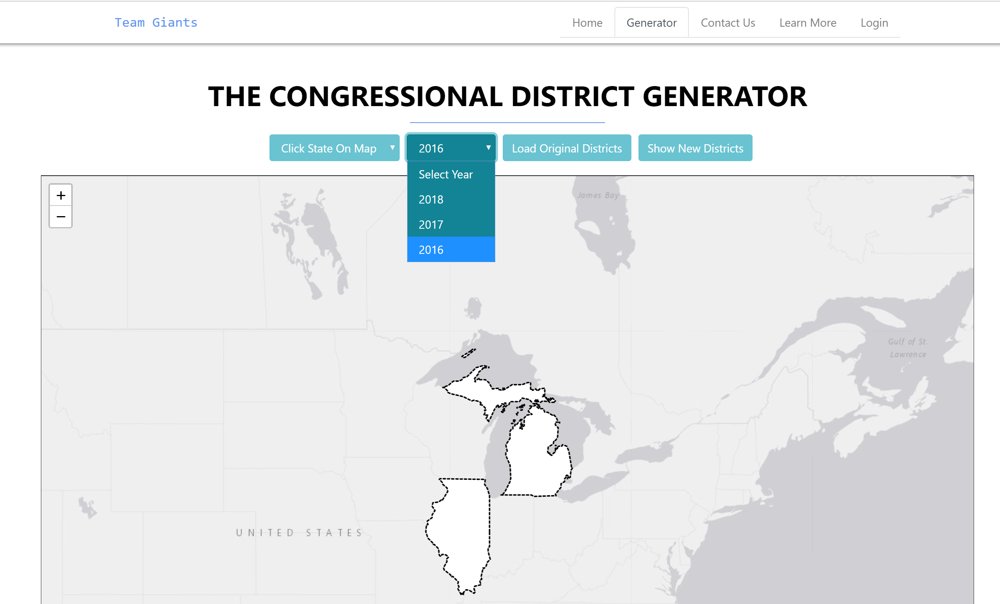
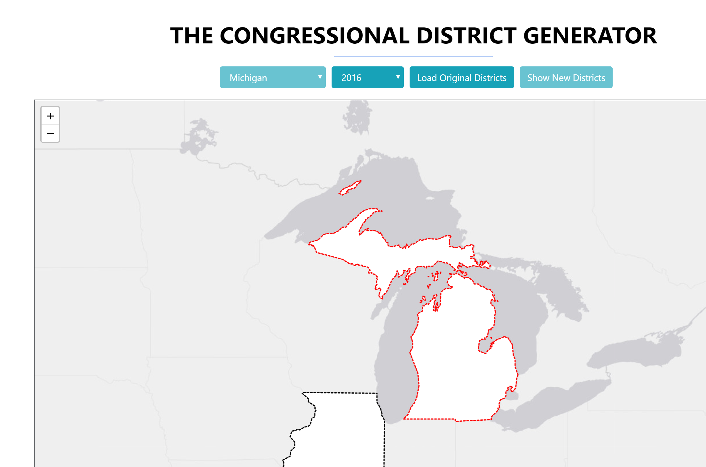
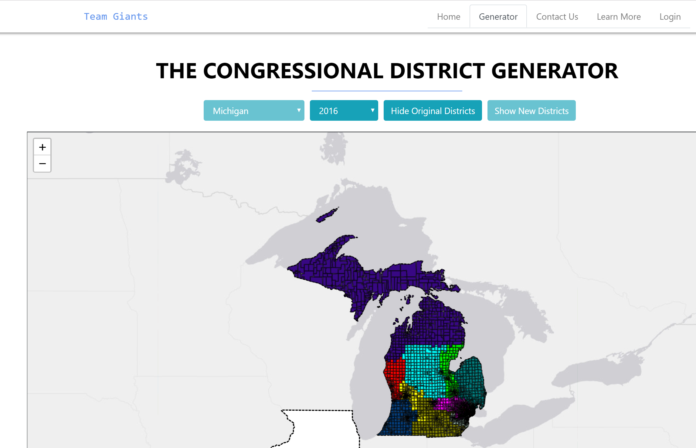
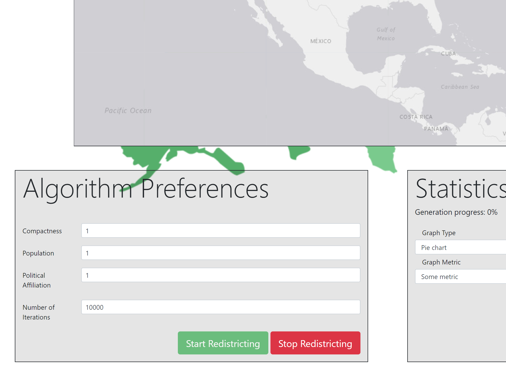
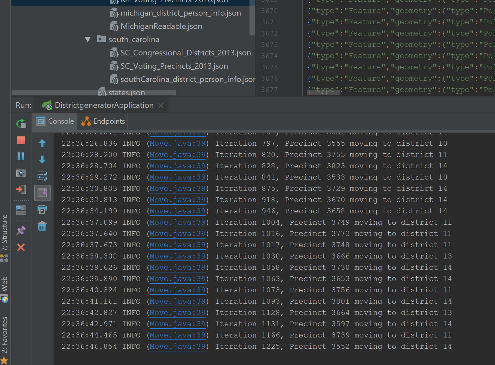

# REST-based Congressional districts redistricting web app
### Kyeongsoo Kim, Jan 2018 ~ May 2018

## Introduction
Gerrymandering is serious issue in the U.S. To prevent it, I made web application where user can set their own parameters for the redistricting plan and run the algorithm to redistribute the congressional district in more fair way. My algorithm is based on simulated annealing approach.[wiki](https://en.wikipedia.org/wiki/Simulated_annealing)

## Database Setup
- create 'giants' database in local mysql server.
- use REST API to push state geojson file to mysql (Spring library will automatically create all the related tables to your local mysql server.)

## Usage
1) Run the Maven application and go to localhost:8080
2) please log in if you want to save some log(optional)
3) set the year of district (currently we have only 2016 data)

    
4) click the state on the map (currently we have Michigan 2016 data)

    
5) click load button. it will load the original congressional district for the given state from mysql database.

    
6) fill in the preferences, run the algorithm.

    
7) you can see the progress of algorithm through console.

    
8) algorithm takes some time. If you want to stop algorithm, click stop button
